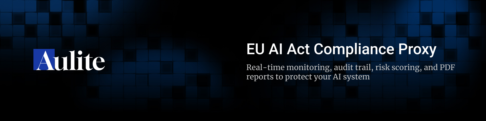
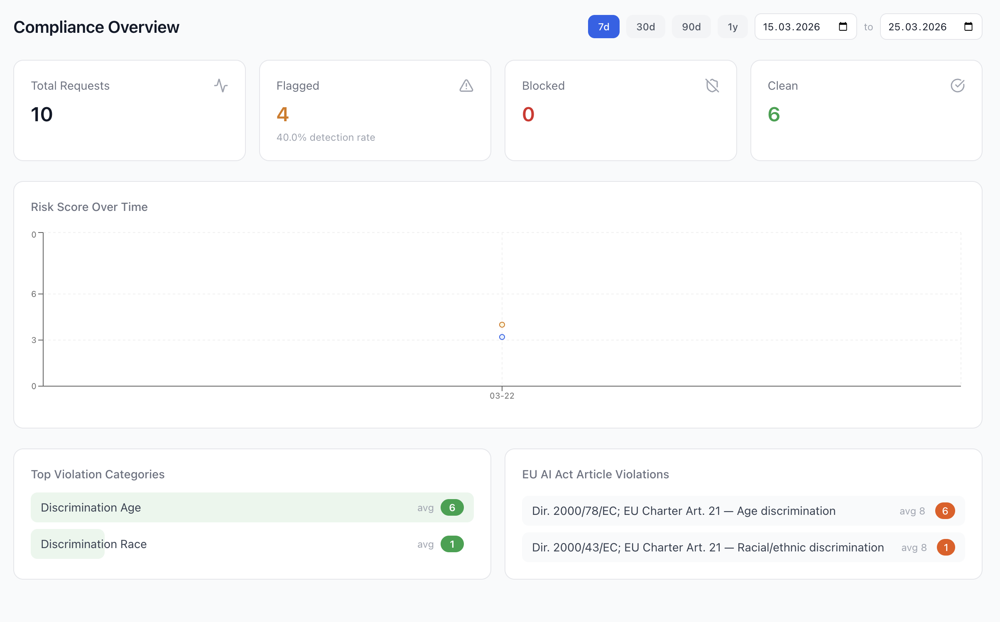
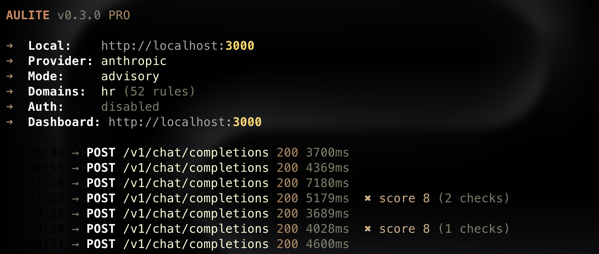

<div align="center">



[](LICENSE.md)
[]()
[](https://hub.docker.com/r/el1ght/aulite)
[](https://hub.docker.com/r/el1ght/aulite)
[]()
[]()
[](https://github.com/el1ght/aulite/stargazers)
[](https://github.com/el1ght/aulite/issues)
[](https://github.com/el1ght/aulite/commits/main)
[]()
[]()
[]()
[]()
[]()
[](https://github.com/el1ght/aulite/pulls)

[Documentation](docs/) · [Quick Start](#quick-start) · [Configuration](docs/configuration.md) · [API Reference](docs/api-reference.md)

</div>

---

Aulite is a transparent HTTP proxy that sits between your application and any AI provider. It analyzes every request and response for EU AI Act compliance risks, logs everything into a tamper-proof hash-chained audit trail, and generates legal-grade PDF reports.

Your application changes one URL. Everything else works exactly as before.

<div align="center">

<br/>
<sub>Compliance Overview — real-time risk monitoring with violation categories and article references</sub>
</div>

```python
client = OpenAI(
    base_url="http://localhost:3000/v1",  # Aulite instead of OpenAI
    api_key="your-aulite-key"
)
```

## Why

The EU AI Act (Regulation 2024/1689) enforcement for high-risk AI systems begins **August 2, 2026**. Non-compliance fines reach **EUR 35M or 7% of global revenue**.

Aulite helps you:

- **Detect** prohibited practices, discrimination, and oversight violations in real time
- **Log** every AI interaction in a tamper-evident audit trail (Art. 12)
- **Report** to regulators with pre-filled FRIA drafts and incident reports (Art. 27, 73)
- **Prove** compliance with hash-chain verification that auditors can independently verify

## Quick Start

```bash
docker run -d \
  -p 3000:3000 \
  -e ANTHROPIC_API_KEY=sk-ant-... \
  el1ght/aulite
```

Open `http://localhost:3000` for the dashboard.

<div align="center">

</div>

## Features

**Analysis Pipeline**

- 143 keyword rules across all 8 EU AI Act Annex III high-risk categories
- 11 EU-specific PII patterns (IBAN, BSN, NIR, national IDs)
- Context-aware matching — "single-threaded" won't trigger, "is the candidate single?" will
- Optional LLM Judge for deeper semantic analysis
- < 5ms overhead for deterministic checks

**Compliance Domains**

| Domain | Annex III | Rules |
|---|---|---|
| HR & Employment | Point 4 | 33 |
| Finance | Point 5 | 13 |
| Biometrics | Point 1 | 12 |
| Education | Point 3 | 13 |
| Critical Infrastructure | Point 2 | 12 |
| Law Enforcement | Point 6 | 14 |
| Migration & Asylum | Point 7 | 13 |
| Justice | Point 8 | 14 |

Base rules (Art. 5 prohibitions, GDPR Art. 9) are always active.

**Audit Trail**

- SHA-256 hash chain — each entry contains the hash of the previous entry
- Tamper-evident, append-only SQLite with WAL mode
- Verifiable at any time via `/verify` endpoint
- Minimum 6 months retention per Art. 26(6)

**Reports**

- Art. 12 Compliance Audit Report (PDF)
- Art. 27 Fundamental Rights Impact Assessment draft (PDF)
- Art. 72 Post-Market Monitoring Report (PDF)
- Art. 73 Serious Incident Report (PDF)

**Dashboard**

- Real-time compliance overview with risk score trends
- Flagged request browser with detail view
- Compliance page with article violation breakdown
- One-click PDF report generation

**Provider Support**

- OpenAI, Anthropic, Azure OpenAI
- Any OpenAI-compatible API (Ollama, vLLM, LocalAI, llama.cpp)
- Auto-routing by model name — `claude-*` → Anthropic, `gpt-*` → OpenAI
- SSE streaming with zero latency penalty

## Configuration

```yaml
provider:
  default: anthropic

analysis:
  mode: advisory
  domains:
    - hr
    - finance
```

All options can be set via environment variables. See [Configuration docs](docs/configuration.md) for details.

## Architecture

```
Client App  →  Aulite (:3000)  →  AI Provider
                    ↓
              Analysis Pipeline
                    ↓
              SQLite Audit Log
                    ↓
              Dashboard + Reports
```

Self-hosted. Single Docker container. Your data never leaves your infrastructure.

See [Architecture docs](docs/architecture.md) for the full request flow.

## Development

```bash
git clone https://github.com/el1ght/aulite.git
cd aulite
npm install
cd dashboard && npm install && cd ..
npm run dev          # start with hot reload
npm test             # 108 tests
npm run build        # production build
```

## Links

- [Documentation](docs/)
- [Configuration](docs/configuration.md)
- [API Reference](docs/api-reference.md)
- [Providers](docs/providers.md)
- [Self-Hosting](docs/self-hosting.md)
